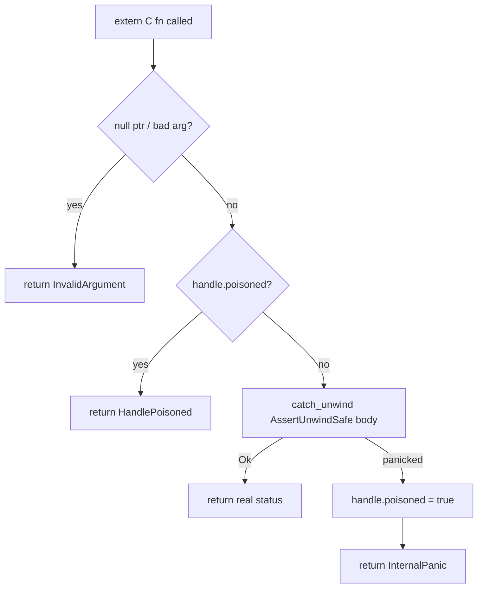

# mediaway-ffi — container mux/demux C ABI (MP4, WebM, Ogg, ADTS)

First `mediaway-*-ffi` crate in the workspace. Wraps `mediaway-container::{mp4,webm}` over a
hand-written C ABI, plus dedicated single-stream handles for `::{ogg,adts}`.
[ADR-0001](../../../../crates/mediaway-ffi/adr/container/0001-mp4-mux-demux-c-abi.md) (MP4),
[ADR-0003](../../../../crates/mediaway-ffi/adr/container/0003-multi-format-c-abi.md) (WebM),
[ADR-0004](../../../../crates/mediaway-ffi/adr/container/0004-ogg-adts-c-abi.md) (Ogg/ADTS).

## Shape

- Opaque handles: `MuxerHandle { poisoned: bool, state: MuxerState }` where
  `MuxerState::{Mp4Open, Mp4Live, WebmOpen, WebmLive}` (one pair per format sharing MP4's
  typestated `add_track`/`begin` shape); `DemuxerHandle { poisoned, inner: DemuxerState }`
  where `DemuxerState::{Mp4, Webm}` — both implement the shared `Demux` trait identically,
  so `as_demux_mut()`/`as_demux()` return `&mut dyn Demux` once instead of duplicating
  `push_bytes`/`streams`/`poll_packet` per variant (muxer's `add_track`/`begin` aren't part
  of any shared trait, so it can't). Single `Box`, no `Rc`/`Arc`; `Open → Live` via
  `std::mem::take` (`Muxer<Open>: Default`).
- `mediaway_muxer_create()`/`mediaway_demuxer_create()` stay MP4-only, zero-argument (source
  compat); `mediaway_*_create_for_format(format)` are new sibling functions taking
  `mediaway_container_format_t` (`MP4 = 0` / `WEBM = 1`) — see ADR-0003 § Decision 1 for why
  a parameter was never added to the existing functions.
- `MediawayStatus` (`#[repr(C)]`, 11 values, `Ok = 0`): `InvalidArgument`/`InvalidState` are
  FFI-only inventions; `InvalidTrack`/`InvalidPacket`/`InvalidData`/`UnknownError` map
  `mp4::Error`; `UnsupportedCodec`/`UnknownStream` (ADR-0003) map `webm::Error`'s two extra
  variants; `InternalPanic`/`HandlePoisoned` are the panic-safety states below. WebM has no
  `ClearKey` support — `set/clear_decryption_key` on a WebM handle return `InvalidState`.
- Modules: `status.rs`, `types.rs`, `buffer.rs` (helpers + shared frees), `muxer.rs`/
  `demuxer.rs` (MP4+WebM), `ogg_muxer.rs`/`ogg_demuxer.rs`, `adts_muxer.rs`/
  `adts_demuxer.rs` (each pair `#[cfg(feature = "mux"/"demux")]`), `lib.rs`.
- **Ogg/ADTS get dedicated handles**, not `MuxerState`/`DemuxerState` variants
  (`mediaway_ogg_muxer_t`/`_demuxer_t`, `mediaway_adts_muxer_t`/`_demuxer_t`, ADR-0004) —
  neither has track registration or `Open`/`Live` typestate. Reuse packet/stream types +
  shared frees; `mediaway_adts_muxer_create` collapses a bad `sample_rate` and a caught
  panic to one `NULL` (no status side channel there).
- **FLV/MPEG-TS/MP3/WAV stay unreachable** — shapes genuinely incompatible with either
  handle family (ADR-0003 § Deferred).

## Panic safety (every exported fn)

Null/argument checks happen *before* `catch_unwind` (cheap, can't panic).
`mediaway_*_close` always succeeds even on a poisoned handle; a panic during `drop` is
deliberately leaked (not double-handled) — see ADR §7.

## Ownership

- Input (extra_data/payload/push_bytes data): caller-owned borrow, valid for the call only.
  One copy at the boundary (`Bytes::copy_from_slice`) builds the owned value. **Not
  Zero-Copy** — C has no refcounted-buffer concept to hand across without inventing one.
- Output (`poll_bytes`, `poll_packet`, `stream_at`): owned buffer, `Vec<u8>` →
  `into_boxed_slice()` → `Box::into_raw()`, freed via the matching `_free` (nulls the
  struct's pointer/len fields, making double-free a visible no-op). `mediaway_packet_t`/
  `mediaway_stream_info_t` do **not** derive `Copy`/`Clone` — they own a raw pointer.

## Corrections vs. the aspirational `bindings/c/examples/mux_roundtrip.c`

Applied per ADR §4: `mediaway_buffer_free` needs a length; track `id` is caller-assigned (no
`out_track_id`); packet struct split into `mediaway_packet_view_t` (input, `const`) vs.
`mediaway_packet_t` (output, owned); `mediaway_rational_t` is `{uint64_t num; uint32_t den;}`.

## Feature flags

`default = ["mux", "demux"]`, gating whole `muxer`/`demuxer` modules — a slim build genuinely
drops the other side's symbols. The `mediaway-container` dep is pinned to
`default-features = false, features = ["mux", "demux", "audio", "video"]` regardless of this
crate's own selection (§9) — spelled out as `path + version` since Cargo forbids
`workspace = true` + `default-features = false` on an inherited dep.

Header: hand-written `include/mediaway/container.h`, not `cbindgen` (§8). ABI version is at
`3` (WebM `1`, Ogg `2`, ADTS `3`); `mediaway_container_ffi_abi_version()` had drifted to a
stale hardcoded `0` since the WebM bump — fixed alongside ADR-0004's own bump.

## ClearKey decrypt + fragment batch (ADR-0002, MP4 only)

`mediaway_demuxer_set/clear_decryption_key` attach to `DemuxerHandle` — one demuxer-wide
`[u8; 16]` key, no per-track/KID check, decrypting synchronously inside `push_bytes`.
`mediaway_muxer_create_with_fragment_batch(batch)` mirrors `mediaway_muxer_create`;
`batch == 0` passes through uncorrected (core clamps to `1`).
[Full design](../../../../crates/mediaway-ffi/adr/container/0002-clearkey-decrypt-and-fragment-batch-c-abi.md).

## Building the C example on Windows

Default toolchain is MSVC (`.lib`), which plain `gcc`/MinGW can't link — build for the GNU
target instead: `cargo build -p mediaway-ffi --target x86_64-pc-windows-gnu`, then
`gcc -Icrates/mediaway-ffi/include bindings/c/examples/container/mux_roundtrip.c
-Ltarget/x86_64-pc-windows-gnu/debug -lmediaway_ffi -o mux_roundtrip.exe`. `gcc` picks the
import lib over the staticlib, so `mediaway_ffi.dll` must sit next to the `.exe` at run time.
Verified end-to-end (90 pushed/recovered video+audio packets).
