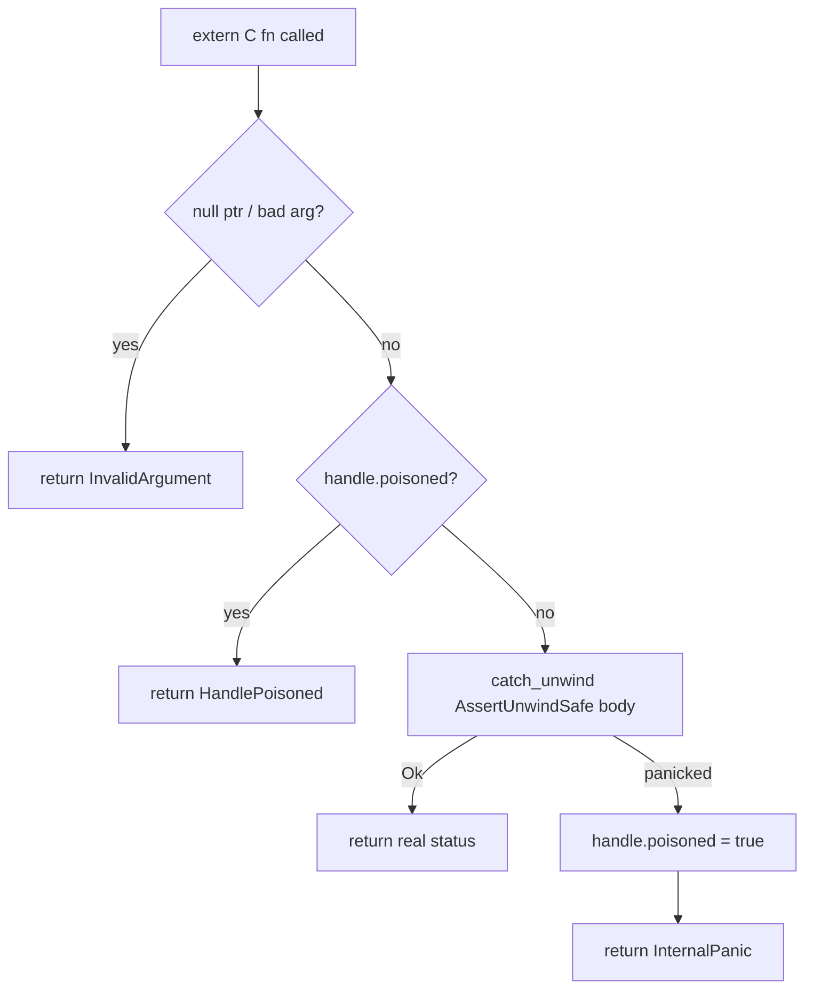

# mediaway-ffi — container mux/demux C ABI (all 8 formats)

First `mediaway-*-ffi` crate in the workspace. All 8 `mediaway-container` formats are
reachable: `mediaway_muxer_t`/`_demuxer_t` wrap `{mp4,webm}`; six formats get dedicated
handles (`{ogg,adts,flv,ts,mp3,wav}`, `wav` mux-only — see below). ADRs:
[0001](../../../../crates/mediaway-ffi/adr/container/0001-mp4-mux-demux-c-abi.md) (MP4),
[0003](../../../../crates/mediaway-ffi/adr/container/0003-multi-format-c-abi.md) (WebM),
[0004](../../../../crates/mediaway-ffi/adr/container/0004-ogg-adts-c-abi.md) (Ogg/ADTS),
[0005](../../../../crates/mediaway-ffi/adr/container/0005-flv-c-abi.md) (FLV),
[0006](../../../../crates/mediaway-ffi/adr/container/0006-mpeg-ts-c-abi.md) (MPEG-TS),
[0007](../../../../crates/mediaway-ffi/adr/container/0007-mp3-c-abi.md) (MP3),
[0008](../../../../crates/mediaway-ffi/adr/container/0008-wav-c-abi.md) (WAV).

## Shape

- `MuxerHandle { poisoned, state: MuxerState::{Mp4Open,Mp4Live,WebmOpen,WebmLive} }`;
  `DemuxerHandle { poisoned, inner: DemuxerState::{Mp4,Webm} }` — both `Demux`, so
  `as_demux_mut()` returns `&mut dyn Demux` once instead of duplicating
  `push_bytes`/`streams`/`poll_packet` per variant (muxer's `add_track`/`begin` aren't part
  of any shared trait, so it can't). `Open → Live` via `std::mem::take`. `_create()` stays
  MP4-only, zero-arg (source compat); `_create_for_format(format)` is the sibling taking
  `mediaway_container_format_t` — ADR-0003 § Decision 1 on why not a parameter instead.
- `MediawayStatus` (`#[repr(C)]`, 11 values): `InvalidArgument`/`InvalidState` are FFI-only;
  `InvalidTrack`/`InvalidPacket`/`InvalidData`/`UnknownError` map `mp4::Error`;
  `UnsupportedCodec`/`UnknownStream` map every other format's analogous rejections. WebM has
  no `ClearKey` — `set/clear_decryption_key` on it returns `InvalidState`.
- **Ogg/ADTS/FLV/MPEG-TS/MP3/WAV get dedicated handles**, not `MuxerState` variants — none
  has track registration or `Open`/`Live` typestate (MPEG-TS fixes streams instead at
  `_ts_muxer_create(program_number, pmt_pid, streams, stream_count)`). Every dedicated
  `_create` collapses a bad input and a caught panic to one `NULL` (no status side channel).
- **FLV/MPEG-TS/MP3's muxers allocate a fresh buffer per call** (`out_data`/`out_len` on
  `_write_header`/`_push_packet`, `_write_pat_pmt`/`_write_access_unit`, or `_write_frame`)
  instead of buffering for `poll_bytes`; `_ts_write_access_unit` takes raw
  `pts_90k`/`has_dts`/`dts_90k` (90 kHz is format-level, not per-track); `_mp3_write_frame`
  takes an explicit `padding` bit `mediaway_packet_view_t` has no slot for.
- **`mediaway_ts_demuxer_finish` returns an owned array** (`out_packets`/`out_count`, its own
  `_finish_free`) — the only multi-packet demux call in this crate.
- **WAV is mux-only as a handle** (`mediaway_wav_muxer_t`, `Option<wav::Muxer>` inside so
  `_finish` can `Option::take` it — `finish` consumes `self`, so a second call or a
  `push_packet` after fails `InvalidState`, not a panic). **Demux has no handle at all**:
  `mediaway_wav_parse(data, len, out_info, out_packet)` is a one-shot whole-buffer function.
  New `mediaway_wav_sample_format_t` (WAVE `wFormatTag`) is **not** `common.h`'s
  `mediaway_sample_format_t` (device/pipeline PCM bit depth) — real naming collision caught
  by `gcc -fsyntax-only`, kept as two distinct enums.

## Panic safety (every exported fn)

Null checks happen *before* `catch_unwind`. `mediaway_*_close` always succeeds even on a
poisoned handle; a `drop` panic is leaked, not double-handled (ADR-0001 §7). `wav_parse` has
no handle to poison — a caught panic there just returns `InternalPanic`.

## Ownership

- Input (extra_data/payload/push_bytes data): caller-owned borrow, valid for the call only,
  copied once at the boundary. **Not Zero-Copy** — C has no refcounted-buffer concept to
  hand across without inventing one.
- Output (`poll_bytes`, `poll_packet`, `stream_at`, `wav_parse`): owned buffer, `Vec<u8>` →
  `into_boxed_slice()` → `Box::into_raw()`, freed via the matching `_free` (nulls the
  struct's pointer/len, making double-free a no-op). `mediaway_ts_demuxer_finish`'s array
  return is the one exception: free each element's payload *and* the array itself, via its
  own `_finish_free` rather than the shared `_packet_free`.

## Feature flags

`default = ["mux", "demux"]`, gating whole `muxer`/`demuxer` modules — a slim build genuinely
drops the other side's symbols (WAV demux has no module to gate, just one fn under `demux`).
`mediaway-container` is pinned to `default-features = false, features = ["mux", "demux",
"audio", "video"]` regardless of this crate's own selection (§9).

Header: hand-written `include/mediaway/container.h`, not `cbindgen` (§8). ABI version `7`
(WebM `1`, Ogg `2`, ADTS `3`, FLV `4`, MPEG-TS `5`, MP3 `6`, WAV `7`) — `_ffi_abi_version()`
drifted to a stale hardcoded `0` since the WebM bump, fixed with ADR-0004's own bump.

## ClearKey decrypt + fragment batch (ADR-0002, MP4 only)

`mediaway_demuxer_set/clear_decryption_key` attach to `DemuxerHandle` (MP4 only) — one
demuxer-wide `[u8; 16]` key, decrypting synchronously inside `push_bytes`.
`mediaway_muxer_create_with_fragment_batch(batch)` mirrors `mediaway_muxer_create`.
[Full design](../../../../crates/mediaway-ffi/adr/container/0002-clearkey-decrypt-and-fragment-batch-c-abi.md).

## Building the C example on Windows

Default toolchain is MSVC (`.lib`), which plain `gcc`/MinGW can't link — build for the GNU
target: `cargo build -p mediaway-ffi --target x86_64-pc-windows-gnu`, then `gcc
-Icrates/mediaway-ffi/include bindings/c/examples/container/mux_roundtrip.c -Ltarget/x86_64-pc-windows-gnu/debug -lmediaway_ffi -o mux_roundtrip.exe`.

**Still open:** no language-binding (C++/C#/Python/Node) wiring for the 6 non-MP4/WebM
formats yet — tracked in ADR-0004 through ADR-0008 § Negative.
