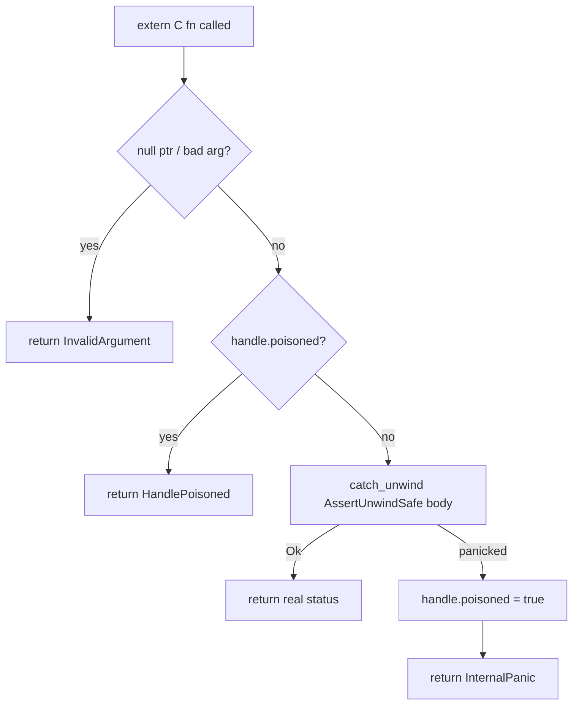

# mediaway-ffi — MP4 mux/demux C ABI

First `mediaway-*-ffi` crate in the workspace. Wraps `mediaway-container::mp4`
(`Muxer<Open|Live>`, `Demuxer`) over a hand-written C ABI. Full design:
[`crates/mediaway-ffi/adr/0001-mp4-mux-demux-c-abi.md`](../../../../crates/mediaway-ffi/adr/0001-mp4-mux-demux-c-abi.md).

## Shape

- Opaque handles: `MuxerHandle { poisoned: bool, state: MuxerState }` where
  `MuxerState::{Open(Muxer<Open>), Live(Muxer<Live>)}`; `DemuxerHandle { poisoned, inner }`.
  Single `Box`, no `Rc`/`Arc`. `Open → Live` via `std::mem::take` (`Muxer<Open>: Default`).
- `MediawayStatus` (`#[repr(C)]`, 9 values, `Ok = 0`): `InvalidArgument`/`InvalidState` are
  FFI-only inventions; `InvalidTrack`/`InvalidPacket`/`InvalidData`/`UnknownError` map
  `mp4::Error` (`#[non_exhaustive]` → wildcard catch-all); `InternalPanic`/`HandlePoisoned`
  are the panic-safety states below.
- Modules: `status.rs`, `types.rs`, `buffer.rs` (helpers + shared frees), `muxer.rs`
  (`#[cfg(feature = "mux")]`), `demuxer.rs` (`#[cfg(feature = "demux")]`), `lib.rs`.

## Panic safety (every exported fn)



Null/argument checks happen *before* `catch_unwind` (cheap, can't panic).
`mediaway_*_close` always succeeds even on a poisoned handle; a panic during `drop` is
deliberately leaked (not double-handled) — see ADR §7.

## Ownership

- Input (`add_*_track` extra_data, `push_packet` payload, `demuxer_push_bytes` data):
  caller-owned borrow, valid for the call only. One copy at the boundary
  (`Bytes::copy_from_slice`) builds the owned Rust value. **Not Zero-Copy** — C has no
  refcounted-buffer concept to hand across without inventing one (deferred).
- Output (`poll_bytes`, `poll_packet`, `stream_at`): owned buffer, `Vec<u8>` →
  `into_boxed_slice()` → `Box::into_raw()`, freed via the matching `_free` (which nulls
  the struct's pointer/len fields, making double-free a visible no-op).
- `mediaway_packet_t`/`mediaway_stream_info_t` do **not** derive `Copy`/`Clone` — they own
  a raw pointer; duplicating the struct would invite a double-free.

## Corrections vs. the aspirational `bindings/c/examples/mux_roundtrip.c`

Applied per ADR §4: `mediaway_buffer_free(data, len)` needs the length; track `id` is a
**caller-assigned** input field (no `out_track_id` out-param); packet struct split into
`mediaway_packet_view_t` (input, `const` payload) vs. `mediaway_packet_t` (output, owned
payload, freed via `mediaway_packet_free`); `mediaway_rational_t` is
`{uint64_t num; uint32_t den;}`.

## Feature flags

`default = ["mux", "demux"]`, gating whole `muxer`/`demuxer` modules (not individual
functions) — a slim build genuinely drops the other side's symbols. The
`mediaway-container` dependency itself is pinned to
`default-features = false, features = ["mux", "demux", "audio", "video"]` regardless of
this crate's own feature selection (§9) — **cannot** use `workspace = true` for that dep
plus `default-features = false` (Cargo forbids overriding an inherited dep's
default-features); spelled out as a direct `path + version` dependency instead.

## Header

Hand-written `include/mediaway/container.h`, not `cbindgen` (§8) — revisit once a second
`-ffi` crate exists.

## ClearKey decrypt + fragment batch (ADR-0002)

`mediaway_demuxer_set/clear_decryption_key(demuxer, key, key_len)` attach to the existing
`DemuxerHandle` (no new handle type) — one demuxer-wide `[u8; 16]` key, no per-track/KID
check (matches `iso_bmff::Demuxer`'s real shape). Decrypt runs synchronously inside
`push_bytes`, so setting/clearing the key only affects *subsequent* `push_bytes` calls, not
packets already queued. `mediaway_muxer_create_with_fragment_batch(batch)` mirrors
`mediaway_muxer_create` exactly but calls `Muxer::with_fragment_batch`; `batch == 0` is
passed through uncorrected (the core clamps to `1`). Full design:
[`adr/0002-clearkey-decrypt-and-fragment-batch-c-abi.md`](../../../../crates/mediaway-ffi/adr/0002-clearkey-decrypt-and-fragment-batch-c-abi.md).

## Building the C example on Windows

Default toolchain here is `x86_64-pc-windows-msvc` (MSVC-ABI `.lib`), which plain `gcc`/MinGW
cannot link against. Build the crate for the GNU target instead — no install needed, already
present via `rustup target list --installed`:

```
cargo build -p mediaway-ffi --target x86_64-pc-windows-gnu
gcc -Icrates/mediaway-ffi/include bindings/c/examples/container/mux_roundtrip.c \
    -Ltarget/x86_64-pc-windows-gnu/debug -lmediaway_ffi -o mux_roundtrip.exe
```

`gcc` picks `libmediaway_ffi.dll.a` (import lib) over the staticlib, so
`mediaway_ffi.dll` must sit next to the `.exe` at run time. Verified end-to-end
(90 pushed / 90 recovered video+audio packets) with no Windows system libs needed beyond
what the DLL already links in.
