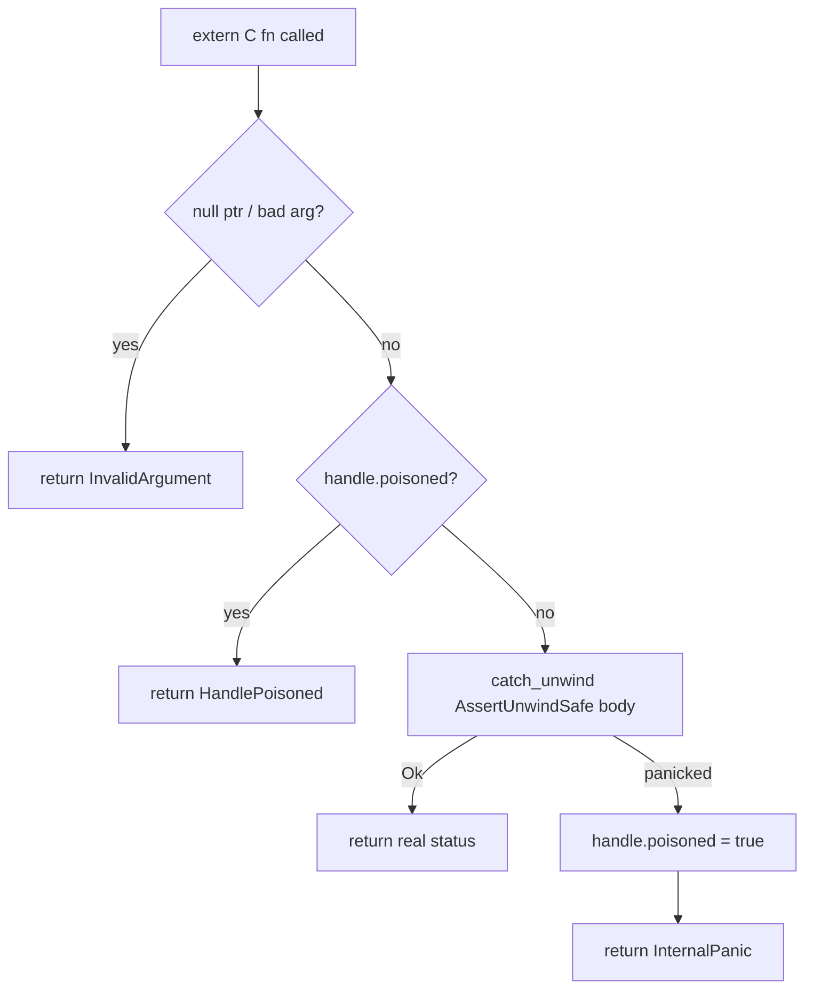

# mediaway-ffi — container mux/demux C ABI (MP4, WebM, Ogg, ADTS, FLV, MPEG-TS, MP3)

First `mediaway-*-ffi` crate in the workspace. Wraps `mediaway-container::{mp4,webm}` over a
hand-written C ABI, plus dedicated handles for `::{ogg,adts,flv,ts,mp3}`. ADRs:
[0001](../../../../crates/mediaway-ffi/adr/container/0001-mp4-mux-demux-c-abi.md) (MP4),
[0003](../../../../crates/mediaway-ffi/adr/container/0003-multi-format-c-abi.md) (WebM),
[0004](../../../../crates/mediaway-ffi/adr/container/0004-ogg-adts-c-abi.md) (Ogg/ADTS),
[0005](../../../../crates/mediaway-ffi/adr/container/0005-flv-c-abi.md) (FLV),
[0006](../../../../crates/mediaway-ffi/adr/container/0006-mpeg-ts-c-abi.md) (MPEG-TS),
[0007](../../../../crates/mediaway-ffi/adr/container/0007-mp3-c-abi.md) (MP3).

## Shape

- Opaque handles: `MuxerHandle { poisoned: bool, state: MuxerState }` where
  `MuxerState::{Mp4Open, Mp4Live, WebmOpen, WebmLive}` (one pair per format sharing MP4's
  typestated `add_track`/`begin` shape); `DemuxerHandle { poisoned, inner: DemuxerState }`
  where `DemuxerState::{Mp4, Webm}` — both implement the shared `Demux` trait identically,
  so `as_demux_mut()`/`as_demux()` return `&mut dyn Demux` once instead of duplicating
  `push_bytes`/`streams`/`poll_packet` per variant (muxer's `add_track`/`begin` aren't part
  of any shared trait, so it can't). Single `Box`, no `Rc`/`Arc`; `Open → Live` via
  `std::mem::take` (`Muxer<Open>: Default`).
- `mediaway_muxer_create()`/`mediaway_demuxer_create()` stay MP4-only, zero-argument (source
  compat); `mediaway_*_create_for_format(format)` are new sibling functions taking
  `mediaway_container_format_t` (`MP4 = 0` / `WEBM = 1`) — see ADR-0003 § Decision 1 for why
  a parameter was never added to the existing functions.
- `MediawayStatus` (`#[repr(C)]`, 11 values, `Ok = 0`): `InvalidArgument`/`InvalidState` are
  FFI-only inventions; `InvalidTrack`/`InvalidPacket`/`InvalidData`/`UnknownError` map
  `mp4::Error`; `UnsupportedCodec`/`UnknownStream` (ADR-0003) map `webm::Error`'s two extra
  variants; `InternalPanic`/`HandlePoisoned` are the panic-safety states below. WebM has no
  `ClearKey` support — `set/clear_decryption_key` on a WebM handle return `InvalidState`.
- Modules: `status.rs`, `types.rs`, `buffer.rs`, `muxer.rs`/`demuxer.rs` (MP4+WebM),
  `{ogg,adts,flv,ts,mp3}_muxer.rs`/`_demuxer.rs` (each pair `#[cfg(feature = "mux"/"demux")]`).
- **Ogg/ADTS/FLV/MPEG-TS/MP3 get dedicated handles**, not `MuxerState`/`DemuxerState`
  variants — none has track registration or `Open`/`Live` typestate (MPEG-TS fixes streams
  instead at `mediaway_ts_muxer_create(program_number, pmt_pid, streams, stream_count)`, no
  `add_track` at all). `_adts_muxer_create`/`_ts_muxer_create`/`_mp3_muxer_create` collapse a
  bad input and a caught panic to one `NULL` alike (no status side channel on any of them).
- **FLV/MPEG-TS/MP3's muxers allocate a fresh buffer per call** (`out_data`/`out_len` params
  on `_write_header`/`_push_packet`, `_write_pat_pmt`/`_write_access_unit`, or
  `_write_frame`) instead of buffering for `poll_bytes`; MPEG-TS's `_write_access_unit`
  takes raw `pts_90k`/`has_dts`/`dts_90k` (90 kHz is format-level); MP3's `_write_frame`
  takes an explicit `padding` bit no `mediaway_packet_view_t` has a slot for (ADR-0005/6/7).
- **`mediaway_ts_demuxer_finish` returns an owned array** (`out_packets`/`out_count`, freed
  via its own `_finish_free`) — the only multi-packet demux call in this crate (ADR-0006).
- **WAV stays unreachable** — one-shot whole-buffer shape incompatible with every handle
  family so far (ADR-0003 § Deferred).

## Panic safety (every exported fn)

Null checks happen *before* `catch_unwind`. `mediaway_*_close` always succeeds even on a
poisoned handle; a `drop` panic is leaked, not double-handled (ADR §7).

## Ownership

- Input (extra_data/payload/push_bytes data): caller-owned borrow, valid for the call only,
  copied once at the boundary. **Not Zero-Copy** — C has no refcounted-buffer concept to
  hand across without inventing one.
- Output (`poll_bytes`, `poll_packet`, `stream_at`): owned buffer, `Vec<u8>` →
  `into_boxed_slice()` → `Box::into_raw()`, freed via the matching `_free`, needing a length
  (nulls the struct's pointer/len, making double-free a no-op) — a correction vs. the
  aspirational `bindings/c/examples/mux_roundtrip.c` (ADR §4). `mediaway_ts_demuxer_finish`'s
  array return is the one exception: free each element's payload *and* the array itself,
  via its own `_finish_free` rather than the shared `_packet_free`.

## Feature flags

`default = ["mux", "demux"]`, gating whole `muxer`/`demuxer` modules — a slim build genuinely
drops the other side's symbols. The `mediaway-container` dep is pinned to
`default-features = false, features = ["mux", "demux", "audio", "video"]` regardless of this
crate's own selection (§9).

Header: hand-written `include/mediaway/container.h`, not `cbindgen` (§8). ABI version `6`
(WebM `1`, Ogg `2`, ADTS `3`, FLV `4`, MPEG-TS `5`, MP3 `6`) — `_ffi_abi_version()` drifted
to a stale hardcoded `0` since the WebM bump, fixed with ADR-0004's own bump.

## ClearKey decrypt + fragment batch (ADR-0002, MP4 only)

`mediaway_demuxer_set/clear_decryption_key` attach to `DemuxerHandle` (MP4 only) — one
demuxer-wide `[u8; 16]` key, decrypting synchronously inside `push_bytes`.
`mediaway_muxer_create_with_fragment_batch(batch)` mirrors `mediaway_muxer_create` (`batch ==
0` uncorrected). [Full design](../../../../crates/mediaway-ffi/adr/container/0002-clearkey-decrypt-and-fragment-batch-c-abi.md).

## Building the C example on Windows

Default toolchain is MSVC (`.lib`), which plain `gcc`/MinGW can't link — build for the GNU
target: `cargo build -p mediaway-ffi --target x86_64-pc-windows-gnu`, then `gcc
-Icrates/mediaway-ffi/include bindings/c/examples/container/mux_roundtrip.c
-Ltarget/x86_64-pc-windows-gnu/debug -lmediaway_ffi -o mux_roundtrip.exe`.
