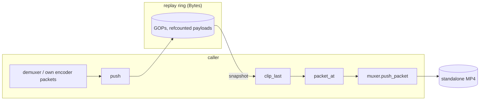
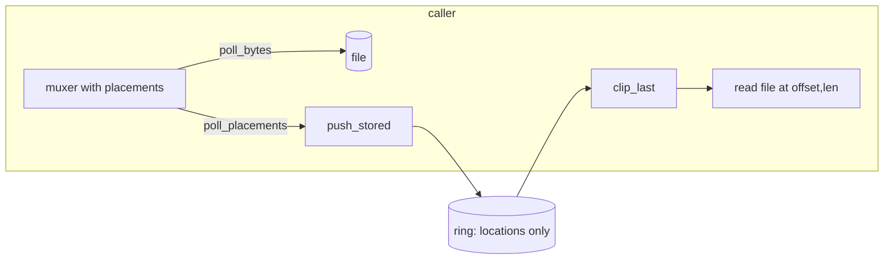

# Replay ring over the container C ABI (ABI 8)

ADR: `crates/mediaway-ffi/adr/container/0009-replay-ring-c-abi.md`. Rust ring: [replay-ring](replay-ring.md).
Code: `src/container/{replay,muxer}.rs`. Tests: `src/container/replay_tests.rs` (hermetic),
`tests/replay_ring_smoke.rs` (real H.264 through the C ABI).

**Limit: the C ABI has no video-packet source.** `mediaway_encode_session` muxes its encoder's packets
internally; packet output exists only for the audio encoder. Feed the ring demuxer packets,
audio-encoder packets, or packets from an encoder you drive yourself.

## Shape

- `mediaway_replay_ring_t`: a closed `enum { Bytes, Stored }` inside, no `Box<dyn>`. `push` (Bytes: copies
  the payload in once) or `push_stored` (metadata + `{file, offset, len}`); the wrong kind is `INVALID_STATE`.
  Times are milliseconds. A dts that goes backwards is `INVALID_PACKET`: drop that packet and carry on.
- `mediaway_replay_clip_t`: an **owned snapshot**. The Rust `Clip` borrows the ring and must be written out
  before the next push; that cannot be enforced in C. A clip holds `Bytes` by refcount, so pushing more,
  evicting, or closing the ring leaves it intact. A Bytes entry's `payload` is borrowed from the clip.
- No "mux this clip" function. Push the entries through the ordinary muxer (`add_*_track`, `push_packet`).
- `mediaway_muxer_create_with_placements` + `mediaway_muxer_poll_placements` (MP4): where each sample landed
  in the output. `len` is the payload as written (Annex-B becomes length-prefixed), and recording changes no bytes.
  **Write order is not push order with two tracks** (a fragment groups samples by track): match a placement to
  its packet by `(track_id, dts)`, never by index.

## Spill to disk (Stored)

## Verified

Real WMF H.264 (four sessions laid end to end, so four keyframes): a 1 s clip of 120 frames at 30 fps starts at
the keyframe of frame 60, payloads equal the pushed packets, a fresh muxer writes it as a file that demuxes to
exactly the clip, placements point at the real bytes, and a Stored ring reads back the Bytes ring's clip.
One WMF session emits a single keyframe then P frames, so the cut logic needs several sessions to be exercised.
