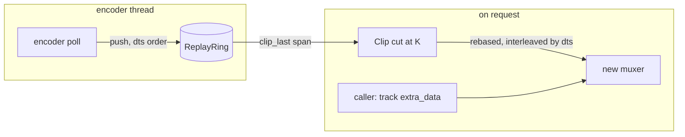

# Replay ring

`mediaway_container::replay::ReplayRing`. ADR:
[`mediaway-container/adr/0004`](../../../../crates/mediaway-container/adr/0004-replay-ring.md).

Holds the last `window` of *encoded* packets for one or more streams, and answers
`clip_last(span)` with a packet sequence a fresh muxer can write as a standalone file.
Sans-io: no I/O, no clock; the caller pushes and asks.

## Rules worth knowing before touching it

- **Anchor stream** (the one passed to `new`) supplies cut points: its keyframes only.
  Other streams (`add_stream`) are cut by time.
- **Decode order everywhere.** Per-stream `dts` must not decrease (`OutOfOrder` otherwise).
  Cut selection and eviction use `dts`.
- **Cut at K** = the latest anchor keyframe with decode time `<= newest - span` (or the
  oldest held). Clips start up to one GOP early, never late.
- **Leading pictures are dropped**: anchor packets after K with `pts < K.pts` (HEVC RASL,
  open GOP). Other streams start at the first packet decoded at or after K's presentation
  time, and since `pts >= dts` need no further filter.
- **Rebase**: K decodes at 0. The anchor shifts by `K.dts`; others by the same instant in
  their own timebase, rounded to nearest.
- **Eviction** drops whole GOPs once the *second* keyframe is `window` old, so a cut point
  always exists at the window start. Memory is the window plus up to one GOP, or
  `with_max_bytes` (the newest GOP is always kept).
- Anchor packets before the first keyframe are discarded on push.
- A `Clip` borrows the ring. Its packets are `Packet` clones: a `Bytes` refcount, no copy.

## Caller obligations

- Force a bounded keyframe interval on the encoder: it is the clip's precision.
- Register the new muxer's tracks with codec config (`extra_data`) from the encoder. The
  ring holds packets only.

Tests: `crates/mediaway-container/src/replay_tests.rs` covers an open-GOP decode-order
sequence, two timebases interleaved, the byte ceiling, and the eviction boundary.
