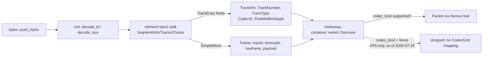

# WebM (EBML) mux + demux

Core: [`ebml-webm`](../../../../crates/ebml-webm) (freestanding, no Mediaway
types). Facade: `mediaway-container::webm` (behind the `demux`/`mux` features).
ADRs: [`ebml-webm/adr/0001`](../../../../crates/ebml-webm/adr/0001-ebml-vint-webm-schema-v1.md),
[`ebml-webm/adr/0002`](../../../../crates/ebml-webm/adr/0002-full-matroska-profile.md) (lacing/`BlockGroup`/`Audio`/`Cues`/`SeekHead`, 2026-07-29),
[`ebml-webm/adr/0003`](../../../../crates/ebml-webm/adr/0003-webm-mux.md) (mux, 2026-07-29),
[`mediaway-container/adr/0001`](../../../../crates/mediaway-container/adr/0001-webm-ebml-demux.md),
[`mediaway-container/adr/0003`](../../../../crates/mediaway-container/adr/0003-webm-mux-facade.md) (mux facade, 2026-07-29).

## Shape

## Demux scope (v1 + full-profile elements)

- EBML VINT decode (`vint::decode_id` / `decode_size`) — public, low-level,
  usable standalone. Unknown-size (indefinite) marker recognized.
- Element walk: `EBML` header (skipped whole), `Segment`, `Segment\Info`
  (`TimecodeScale`), `Tracks`/`TrackEntry` (`TrackNumber`, `TrackType`,
  `CodecID`, `Video\PixelWidth`/`PixelHeight`, `Audio\SamplingFrequency`/
  `Channels`), `Cluster` (`Timecode`), `Cues`, `SeekHead`.
- `SimpleBlock` **and** `BlockGroup`/`Block`/`BlockDuration`/`ReferenceBlock` →
  `Frame` (track number, absolute timecode, keyframe flag, optional
  `duration_ticks`). Keyframe-ness for a `BlockGroup`'s `Block` is the
  *absence* of a sibling `ReferenceBlock`.
- Lacing (Xiph, fixed-size, **and** EBML — all three) — laced sub-frames share
  one timecode (Matroska doesn't encode a distinct one per sub-frame; a real
  spec property). Malformed lace data drops the block cleanly, never panics.
- `Demuxer::cues()` / `seek_head()` expose `Segment\Cues`/`SeekHead` as
  informational data — this crate does no seeking itself (sans-io: I/O and
  seek-driven re-reads are the adapter's job).

## Deferred (tracked in both crates' roadmaps, not silently dropped)

- Sibling-ID lookahead to close indefinite-size `Cluster` early — still keeps
  such a context open until the parent closes or EOF. Fine for typical
  definite-size-cluster files; a long-running indefinite-size live stream can
  grow the open-element stack unboundedly.
- `SimpleBlock` lacing on the **mux** side (never lacs; demux reads all three
  kinds for other encoders' output — see Mux section below).

## Mux (2026-07-29)

`ebml_webm::mux::Muxer<Open | Live>` mirrors `iso_bmff::mux`'s typestate shape:
`add_track` → `begin()` → `push_frame` → `poll_bytes`. `Segment` is always
unknown-size (streaming-first); each `Cluster` batches frames into a
known-size block, closing early on a full batch or a relative-timecode
overflow (`SimpleBlock`'s signed 16-bit offset field). New public, low-level,
**total** (never panic on out-of-range input) `vint::encode_id`/`encode_size`/
`encode_unknown_size` alongside the existing decoders. `mediaway-container::webm::Muxer`
wraps it as a full `Mux` trait impl, rejecting any `CodecKind` `WebM` has no
`CodecID` for (same set demux recognizes: `Vp9`/`Av1`/`Opus`/`Vorbis`/`Aac`).
No external WebM mux oracle exists in this workspace — verified by
round-tripping through this crate's own `Demuxer` instead (`mux_tests.rs`,
`webm_tests.rs`).

## Facade gaps closed (2026-07-29)

- `Demuxer::poll_packet` threads `Frame::duration_ticks` into `Packet::duration`
  (`BlockGroup`'s `BlockDuration`; `SimpleBlock` frames default to 0).
- `StreamInfo::Audio` (`mediaway-common`) gained real `sample_rate`/`channels`
  fields (shared type, also used by `mp4.rs`, WASAPI, WMF AAC) — threaded through.
- `Demuxer::cues()`/`seek_head()` pass `ebml_webm::{CuePoint, SeekEntry}` through
  unchanged (plain offsets, nothing codec-specific to convert).

## Real bug found via FATE testing (2026-07-29)

`fate_manifest.txt` samples chunk-fed 1–64 bytes at a time reproduced a panic
synthetic tests never hit: a `BlockGroup`'s `Block` payload was stored as raw
`(start, end)` offsets into `buffer`, converted to a `Frame` only when the
group's closing tag arrived — but `compact()` can drop that buffer prefix in
between on a slow-fed file (`SimpleBlock` was unaffected — synchronous, no
deferred state). Fix: copy payload bytes out at parse time
(`ParsedBlock::payloads: SmallVec<[Bytes; 8]>`) instead of deferring a
byte-range reference. Lesson: a sans-io demuxer deferring anything referencing
`buffer` across a container-close boundary needs owned bytes, not a rebase —
a plain rebase underflows when the deferred range falls entirely inside the
drained prefix, not merely shifted by it.

## Known product gap: VP8

`ebml_webm::TrackInfo::codec_id` keeps the raw WebM `CodecID` string.
`mediaway-container::webm` maps every codec `CodecKind` has (`Vp9`, `Av1`,
`Opus`, `Aac`, `Vorbis` — `Vorbis` closed 2026-07-29 once the Ogg facade work
added the variant). Real WebM files can still use VP8 video — that track
parses structurally in `ebml-webm` but is **omitted** from the facade's
`streams()`, and its frames are dropped in `poll_packet()`. Fix requires a
`CodecKind::Vp8` variant, tracked in `mediaway-container/docs/roadmap.md`.
