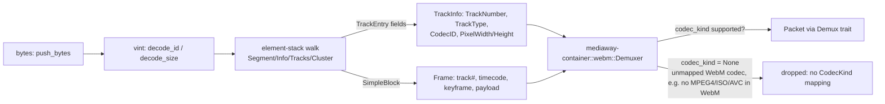

# WebM (EBML) mux + demux

Core: [`ebml-webm`](../../../../crates/ebml-webm) (freestanding, no Mediaway
types). Facade: `mediaway-container::webm` (behind the `demux`/`mux` features).
ADRs: [`ebml-webm/adr/0001`](../../../../crates/ebml-webm/adr/0001-ebml-vint-webm-schema-v1.md),
[`ebml-webm/adr/0002`](../../../../crates/ebml-webm/adr/0002-full-matroska-profile.md) (lacing/`BlockGroup`/`Audio`/`Cues`/`SeekHead`, 2026-07-29),
[`ebml-webm/adr/0003`](../../../../crates/ebml-webm/adr/0003-webm-mux.md) (mux, 2026-07-29),
[`ebml-webm/adr/0004`](../../../../crates/ebml-webm/adr/0004-cluster-lookahead-and-mux-lacing.md) (Cluster lookahead + mux lacing, 2026-08-05),
[`mediaway-container/adr/0001`](../../../../crates/mediaway-container/adr/0001-webm-ebml-demux.md),
[`mediaway-container/adr/0003`](../../../../crates/mediaway-container/adr/0003-webm-mux-facade.md) (mux facade, 2026-07-29).

## Shape

## Demux scope (v1 + full-profile elements)

- EBML VINT decode (`vint::decode_id` / `decode_size`) — public, low-level,
  usable standalone. Unknown-size (indefinite) marker recognized.
- Element walk: `EBML` header (skipped whole), `Segment`, `Segment\Info`
  (`TimecodeScale`), `Tracks`/`TrackEntry` (`TrackNumber`, `TrackType`,
  `CodecID`, `Video\PixelWidth`/`PixelHeight`, `Audio\SamplingFrequency`/
  `Channels`), `Cluster` (`Timecode`), `Cues`, `SeekHead`.
- `SimpleBlock` **and** `BlockGroup`/`Block`/`BlockDuration`/`ReferenceBlock` →
  `Frame` (track number, absolute timecode, keyframe flag, optional
  `duration_ticks`). Keyframe-ness for a `BlockGroup`'s `Block` is the
  *absence* of a sibling `ReferenceBlock`.
- Lacing (Xiph, fixed-size, **and** EBML — all three) — laced sub-frames share
  one timecode (Matroska doesn't encode a distinct one per sub-frame; a real
  spec property). Malformed lace data drops the block cleanly, never panics.
- `Demuxer::cues()` / `seek_head()` expose `Segment\Cues`/`SeekHead` as
  informational data — this crate does no seeking itself (sans-io: I/O and
  seek-driven re-reads are the adapter's job).

## Mux (2026-07-29; lacing + oracle added 2026-08-05)

`ebml_webm::mux::Muxer<Open | Live>` mirrors `iso_bmff::mux`'s typestate shape:
`add_track` → `begin()` → `push_frame`/`push_laced_frames` → `poll_bytes`.
`Segment` is always unknown-size (streaming-first); each `Cluster` batches
frames into a known-size block, closing early on a full batch or a
relative-timecode overflow (`SimpleBlock`'s signed 16-bit offset field). New
public, low-level, **total** (never panic on out-of-range input)
`vint::encode_id`/`encode_size`/`encode_unknown_size`/`encode_signed_delta`
alongside the existing decoders. `push_laced_frames` writes one EBML-laced
`SimpleBlock` for several sub-frames sharing a timecode (`lacing::encode_ebml_lace_sizes`,
the exact inverse of the demux side's `Lacing::Ebml` decode). `mediaway-container::webm::Muxer`
wraps `push_frame` as a full `Mux` trait impl, rejecting any `CodecKind` `WebM` has no
`CodecID` for (same set demux recognizes: `Vp8`/`Vp9`/`Av1`/`Opus`/`Vorbis`/`Aac`).
`push_packet` maps `Packet::pts` straight to the block timecode — ticks are
milliseconds (`TimecodeScale` default 1 ms/tick), so callers must convert other
time bases (the playback harness does `/48` for 48 kHz Opus).
Verified two ways: round-tripping through this crate's own `Demuxer`
(`mux_tests.rs`, `webm_tests.rs`), and an external ffprobe oracle
(`tests/mux_oracle.rs`, Tier 7 — skips cleanly when ffprobe is absent).

## Facade gaps closed

- 2026-07-29: `Demuxer::poll_packet` threads `Frame::duration_ticks` into
  `Packet::duration`; `StreamInfo::Audio` real `sample_rate`/`channels`;
  `Demuxer::cues()`/`seek_head()` pass `ebml_webm` types through unchanged.
- 2026-08-05: indefinite-size `Cluster` sibling-ID lookahead
  (`ids::is_segment_level_child` — RFC 8794 §9.4) closes an open `Cluster`
  when the next element can only be a `Segment`-level sibling, instead of
  nesting it and growing the open-element stack once per `Cluster` for a
  long-running live stream. `CodecKind::Vp8` added and wired into
  `webm.rs::codec_kind`/`webm_codec_id` — the WebM VP8 gap is fully closed
  (mux + demux); `Vorbis` had already closed the audio half 2026-07-29.

## Real bug found via FATE testing (2026-07-29)

`fate_manifest.txt` samples chunk-fed 1–64 bytes at a time reproduced a panic
synthetic tests never hit: a `BlockGroup`'s `Block` payload was stored as raw
`(start, end)` offsets into `buffer`, converted to a `Frame` only when the
group's closing tag arrived — but `compact()` can drop that buffer prefix in
between on a slow-fed file (`SimpleBlock` was unaffected — synchronous, no
deferred state). Fix: copy payload bytes out at parse time
(`ParsedBlock::payloads: SmallVec<[Bytes; 8]>`) instead of deferring a
byte-range reference. Lesson: a sans-io demuxer deferring anything referencing
`buffer` across a container-close boundary needs owned bytes, not a rebase —
a plain rebase underflows when the deferred range falls entirely inside the
drained prefix, not merely shifted by it.

