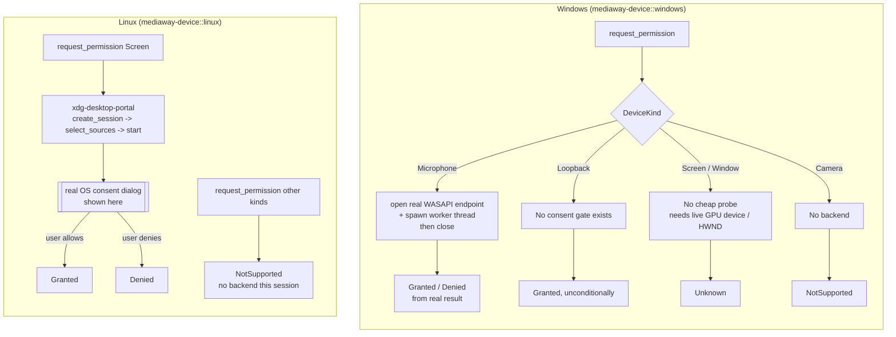

# Capability / permission probe

Facade: [`mediaway-device`](../../../../crates/mediaway-device) —
`DeviceKind` / `Support` / `Unavailable` / `PermissionState` ([ADR-0003](../../../../crates/mediaway-device/adr/0003-capability-and-permission-probe.md)).
Backends: `mediaway-device::windows`/`mediaway-device::linux` `capabilities.rs`. Dispatch:
`mediaway::platform::{device_support, request_device_permission}`.

## Two separate questions

- **`support(kind)`** — is a backend linked *and* does this machine have what
  it needs right now? Tiered as [`Unavailable::NotImplemented`] (no code —
  won't change without a rebuild), [`OsVersionTooOld`] (checked live, e.g.
  `GraphicsCaptureSession::IsSupported`), or [`NoDeviceFound`] (no matching
  device/service found right now — can change without a rebuild, e.g. plug in
  a mic, start a desktop session).
- **`request_permission(kind)`** — does the OS actually grant access? Windows
  and Linux answer this completely differently (see below) — this is *not* a
  free query, document the cost per kind.

## Windows vs Linux: no shared consent mechanism

- **Windows has no proactive consent-dialog API** for a Win32 desktop app.
  Mic/camera access is gated by *Settings > Privacy*; the only way to observe
  a denial is to actually try opening the device. That's why
  `request_permission(Microphone)` is a real, costly probe — not a cheap
  query — and callers must cache the result rather than call it per frame.
- **Linux's portal *is* the consent mechanism.** There is no cheaper way to
  ask "is screen-share granted" than actually starting the
  `ScreenCast` session — `support(Screen)` stops short of that (D-Bus
  interface reachability only, no dialog), `request_permission(Screen)` goes
  all the way through it.

## Testing real hardware without crashing

Rust's default test harness runs `#[test]`s concurrently. Concurrent real
DXGI/WGC/WASAPI sessions from this crate's `_or_skip` tests reproduced a
genuine `STATUS_ACCESS_VIOLATION` crash the first time capability tests were
added alongside the existing hardware tests — not hypothetical. Fixed with a
module-wide `HARDWARE_TEST_LOCK` mutex (`crates/mediaway-device/src/windows/mod.rs`)
that every real-hardware test acquires for its duration; pure-logic tests
(e.g. `Camera` → `NotImplemented`) don't need it.

## Known gaps

- Linux `support`/`request_permission` only handle `Screen` — Window/Camera/
  Microphone/Loopback have no backend this session (see crate roadmap).
- Windows `Screen`/`Window` permission is `Unknown`, not resolved further —
  would need a live GPU device handle or target `HWND` passed into the probe,
  which this coarse, session-free API deliberately doesn't take.
