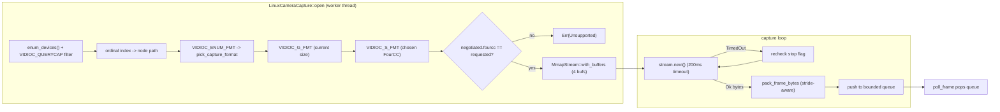

# Linux camera capture: V4L2

Module: `mediaway-device::linux`, `src/camera.rs`. ADR: [`0002-v4l2-camera-capture.md`](../../../../crates/mediaway-device/adr/linux/0002-v4l2-camera-capture.md).

## Flow

## Key decisions (see ADR-0002 for full rationale)

- `v4l` crate (`default-features = false, features = ["v4l2"]`) — MIT,
  `bindgen`-derived raw `<linux/videodev2.h>` ioctls, no runtime library link.
  Rejected hand-rolled `libc` ioctls (deriving `_IOWR` request numbers by hand
  is a real, silent-failure-prone surface) and the crate's own `libv4l`
  feature (would add a runtime LGPL `libv4l2`/`libv4lconvert` link this
  backend doesn't need).
- Format priority: `YUYV` > `NV12` > `YU12` (I420) — first one the device
  actually advertises via `VIDIOC_ENUM_FMT` wins. **No `MJPG` support** (needs
  a JPEG decoder, out of scope) — a webcam offering only compressed formats
  has no supported format this session.
- `PixelFormat::Yuyv` is a new variant added to `mediaway-common` this
  session (packed YUV 4:2:2) — `formats.rs` already invites extension.
- Driver format substitution is rejected, not silently accepted: if
  `VIDIOC_S_FMT`'s response `FourCC` differs from what was requested, `open`
  fails rather than mis-parsing bytes as the wrong layout.
- **Zero `unsafe` in `camera.rs`** — the `v4l` crate's surface used here is
  fully safe Rust; `mmap`/ioctl `unsafe` lives inside `v4l`/`v4l2-sys-mit`.
  This also makes the stride-aware byte-packing (`pack_frame_bytes`) directly
  unit-testable with synthetic `&[u8]` buffers — no live device needed.
- Real dependency footgun found: `v4l::io::mmap::Stream`'s `Drop` panics if
  `VIDIOC_STREAMOFF` fails for any reason other than `ENODEV` — inherited
  risk, not something this crate's code controls.

## Zero runtime verification (important)

**No real V4L2 device was exercised.** WSL2 has `<linux/videodev2.h>` (so
`bindgen` can run) but **zero `/dev/video*` nodes** — confirmed via `ls
/dev/video*` (no such file or directory). Compile-checked only.

## Related

- [linux-capture.md](linux-capture.md) — screen capture (same crate)
- [windows-capture.md](windows-capture.md) — `mediaway-device::windows_camera::capture.rs`
  for architecture comparison (Media Foundation, needs `unsafe`)
