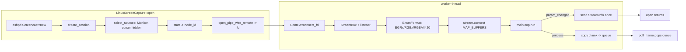

# Linux screen capture: portal + PipeWire

Crate: `mediaway-device-linux`. ADR: [`0001-portal-pipewire-screen-capture.md`](../../../../crates/mediaway-device-linux/adr/0001-portal-pipewire-screen-capture.md).

## Flow

## Key decisions (see ADR-0001 for full rationale)

- Portal-mediated (`org.freedesktop.portal.ScreenCast`), **not** raw X11 — X11
  `XShm`/`XComposite` capture does not work under Wayland compositors.
- `output_index` must be `0` — the portal's own picker chooses the monitor
  interactively; there is no programmatic "pick output *N*" like
  `IDXGIAdapter::EnumOutputs`.
- **CPU copy only this session** — negotiates `MAP_BUFFERS` (`MemPtr`/`MemFd`),
  never `DmaBuf`. `CaptureOutputPreference::ZeroCopyGpu` is rejected rather
  than silently served from CPU. GPU Zero-Copy (importing the dma-buf fd into
  a `VkImage`/`EGLImage`) is deferred — would need a new `GpuBufferHandle`
  variant in `mediaway-common` plus a GPU-API dependency, out of scope here.
- `BGRx`/`RGBx` → `PixelFormat::Bgra8`/`Rgba8` is an approximation (4th byte
  is unused padding, not real alpha) — same call Windows DXGI makes for its
  BGRA desktop surface.
- Custom `block_on` (in `portal.rs`) avoids a third async-runtime dependency:
  `ashpd`'s `async-io` feature already drives D-Bus readiness via its own
  reactor thread; any `Waker` wakes a park/poll loop correctly.

## Zero runtime verification (important)

**No real desktop portal session, PipeWire stream, or compositor was
exercised.** Written in a WSL2 environment with no portal-capable desktop
session. Compile-checked only (`cargo check`/`clippy`/`test` under WSL2 with
`libpipewire-0.3-dev` installed). The `_or_skip` unit test
(`screencast_tests.rs`) is expected to skip here and did, observed returning
`CaptureError::AccessDenied` from the real (failing) D-Bus handshake attempt.
Unlike `mediaway-device-windows` (DXGI/WGC/WASAPI — real hardware verification
in earlier sessions), this backend has none yet.

## Related backends (same crate, later session)

Camera (V4L2), window capture (portal `SourceType::Window`), and microphone
(direct PipeWire audio) all landed in a later session — see
[linux-camera.md](linux-camera.md), [linux-window.md](linux-window.md),
[linux-mic.md](linux-mic.md).
