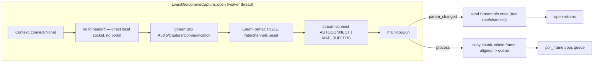

# Linux microphone capture: direct PipeWire audio stream

Crate: `mediaway-device-linux`, `src/mic.rs`. ADR: [`0004-pipewire-microphone-capture.md`](../../../../crates/mediaway-device-linux/adr/0004-pipewire-microphone-capture.md).

## Flow

## Key decisions (see ADR-0004 for full rationale)

- **No portal involved** — unlike screen/window capture, regular `PipeWire`
  clients connect straight to the daemon's local socket
  (`Context::connect(None)`, not `connect_fd`) to capture audio; there is no
  `org.freedesktop.portal.*` consent step for this operation on desktop
  Linux. This is a real, load-bearing difference from
  [linux-capture.md](linux-capture.md)/[linux-window.md](linux-window.md),
  not an oversight.
- Reuses the already-depended-on `pipewire` crate (zero new Cargo
  dependencies) rather than adding `alsa` — on a PipeWire-routed desktop, raw
  ALSA capture usually re-enters PipeWire's own ALSA-compat shim anyway.
  WSL2 also has `libpipewire-0.3-dev` but no `alsa.pc` this session,
  reinforcing the pragmatic choice.
- Only `AudioCaptureSource::Microphone { device_index: 0 }` (default source)
  + `SampleFormat::F32` this session — same restriction shape
  `mediaway-device-windows` `wasapi.rs` applies to its own first slice.
  `Loopback`/`ProcessLoopback` and non-default source targeting are deferred.
- `capabilities::support(Microphone)` is a real (cheap, non-streaming)
  daemon-connect probe; `request_permission` reports `Granted` once
  reachable — honestly modeling that PipeWire mic capture has no consent gate
  to check, rather than faking a permission model that doesn't exist here.
- Zero `unsafe` in `mic.rs` (same property `screencast.rs` already has).

## Zero runtime verification (important)

**No running PipeWire daemon in WSL2** this session (dev headers only —
`pkg-config --modversion libpipewire-0.3` reports `1.0.5`, but no daemon
process). Compile-checked only.

## Related

- [linux-capture.md](linux-capture.md) — screen capture (same crate, portal-mediated)
- [windows-audio.md](windows-audio.md) — WASAPI mic/loopback for comparison
