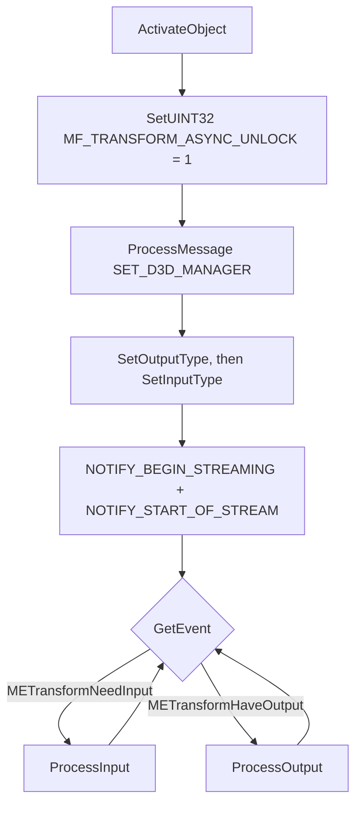

# Async encoder MFTs — the contract, and how it was broken

Windows encoder MFTs come in two flavours and the difference is load-bearing.
**Every NVIDIA encoder MFT is async; Intel QuickSync's are sync.** `MFT_ENUM_FLAG_SORTANDFILTER`
puts the NVIDIA one first on a machine that has one, so which contract you are speaking is
decided by the hardware, not by your code.

Detect with `MF_TRANSFORM_ASYNC` on `IMFTransform::GetAttributes()`.

## The async contract

Three rules, each of which mediaway violated ([ADR-0012](../../../../crates/mediaway-encoder/adr/windows/0012-async-mft-zero-copy-sequencing.md)):

1. **Unlock before everything.** `MF_TRANSFORM_ASYNC_UNLOCK` precedes *every* other call,
   including `SET_D3D_MANAGER`.
2. **Never `ProcessOutput` unannounced.** Only after a `METransformHaveOutput`.
3. **Input and output interleave.** The MFT stops issuing `METransformNeedInput` until you
   collect the output it already produced. A wait-for-input loop that does not drain output
   deadlocks after frame 1.

Sync MFTs have none of this: no unlock, no events, and "nothing ready" arrives as
`MF_E_TRANSFORM_NEED_MORE_INPUT` from `ProcessOutput`.

## Failure signatures

| Symptom | Cause |
|---|---|
| `open` fails, `MF_E_TRANSFORM_ASYNC_LOCKED` (`0xC00D6D77`) | Something was called before the unlock |
| First `push_frame` fails | `ProcessOutput` called without `METransformHaveOutput` |
| **Second** `push_frame` fails after a timeout | Input wait is not servicing output |

## Why this read as an "environment gap" for so long

`screen-record-av.md` used to record these as "on some execution sessions, MF hardware
transforms fail to activate," and tests were written to skip on it. That was wrong, and the
shape of the bug is what made it convincing: the path worked on machines whose selected MFT
happened to be **sync**, and failed on every machine with NVIDIA hardware. "Works on some
machines, not others" looks like an environment problem.

It is not. Measured 2026-09-18 on an RTX 4090 + Intel UHD 770, in both interactive and
background sessions: `MFTEnumEx(…HARDWARE)` returns 3 H.264 and 3 HEVC entries, the NVIDIA
MFTs `ActivateObject` fine, `MF_SA_D3D11_AWARE` is 1, and `MFCreateDXGIDeviceManager` +
`ResetDevice` both succeed. Nothing about the environment was blocking anything.

**Lesson worth keeping:** a capability probe that fails identically on every codec, format
and resolution is not reporting a codec/format/resolution problem. Step the open sequence
and read the actual `HRESULT` — `0xC00D6D77` named this bug in one line after months of it
being filed under "environment."

## Where it lives

- `src/windows/wmf/dx11.rs` — `open_hw_encoder` (ordering), `Dx11Session::have_output`,
  `take_have_output`, `has_need_input`, `drain_events`
- `src/windows/wmf/video.rs` — `await_need_input` (the interleaving wait), `drain_output`
- `src/windows/wmf/video_tests.rs` — `dx11_zero_copy_encodes_multiple_frames_or_skip`;
  it pushes **several** frames on purpose, since each of the three defects surfaced at a
  different frame index.

## Verified result

RTX 4090, 1920×1080, Zero-Copy DX11: H.264 and HEVC both encode, from **NV12 and BGRA**
input alike. BGRA working end to end means a WGC/DDA `Bgra8` surface reaches the encoder
with no colour conversion — the point of `configure_types`' ARGB32-first "live-recorder
pattern".
