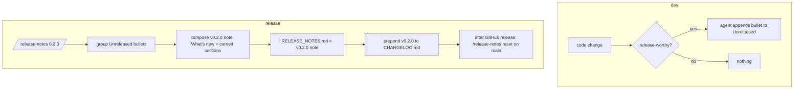

# Release notes workflow

Dev changes accumulate automatically under `## Unreleased` in
[`RELEASE_NOTES.md`](../../../../RELEASE_NOTES.md); at release time they are
finalized into the versioned note the release pipeline consumes.

## Files

| Path | Role |
|------|------|
| `RELEASE_NOTES.md` | Transient: `## Unreleased` during dev → versioned note at release (GitHub release `--notes-file`) |
| `CHANGELOG.md` | Permanent version history (Keep a Changelog); most recent section is the skeleton source for the next release note |
| `.claude/commands/release-notes.md` | `/release-notes <version>` finalizes; `/release-notes reset` restores the template |

## Package registry links

`/release-notes <version>`'s `## Bindings` composition step hyperlinks every named
package to its registry page — keep this table in sync when a package is added,
renamed, or removed (source of truth: each package's own manifest, not this table).

| Ecosystem | Package(s) | URL pattern |
|-----------|------------|-------------|
| crates.io | `mediaway`, `mediaway-container`, `mediaway-encoder`, `mediaway-decoder`, `mediaway-device`, `mediaway-sw`, `mediaway-common`, freestanding cores (`iso-bmff`, `ebml-webm`, `flv-core`, `mpeg-ts-core`, `mpeg-audio`, `iso-cenc`, `ogg-core`, `adts-core`, `riff-wave-core`, `rtp-core`, ...) | `https://crates.io/crates/<name>` |
| NuGet | `Mediaway.Common`, `Mediaway.Container`, `Mediaway.Device`, `Mediaway.Device.Audio`, `Mediaway.Device.Camera`, `Mediaway.Device.Desktop`, `Mediaway.Device.Hotplug`, `Mediaway.Pipeline` (PackageId defaults to `AssemblyName`, `bindings/csharp/src/Directory.Build.props`) | `https://www.nuget.org/packages/<PackageId>` |
| PyPI | `mediaway` (`bindings/python/pyproject.toml`) | `https://pypi.org/project/<name>/` |
| npm | `@mediaway/ffi`, `@mediaway/container`, `@mediaway/device`, `@mediaway/encoder`, `@mediaway/decoder`, `@mediaway/browser` (`bindings/{nodejs,browser}/packages/*/package.json`) | `https://www.npmjs.com/package/<name>` |
| C headers | no registry — `mediaway_ffi.h` + CMake/CPack archives ship as GitHub Release assets | `https://github.com/nyxways/mediaway/releases/tag/v<version>` |

Rust crates are the primary API, not a "binding" — the `## Bindings` section only
lists the non-Rust surfaces (C/C#/Python/Node/Browser); the crates.io row above is
for reference if a future section ever needs it.

## Dev rule (AGENTS.md § 10)

Agents add a bullet to `## Unreleased` when a change is release-note-worthy:
user-visible features, fixes, behavior changes, deprecations, breaking
changes, new platform/codec/binding support. Skip internal refactors,
docs-only, test-only, dev-tooling changes. Subsection = `Added` / `Changed` /
`Fixed` / `Removed` / `Deprecated` / `Breaking`.

## Release flow

## Runbook

1. Bump `[workspace.package] version` (root `Cargo.toml`); update
   `docs/spec/status.md` if maturity changes.
2. `/release-notes <version>` — checks the version matches, groups Unreleased,
   composes the note, archives, reports.
3. Push `release/vX.Y.Z`; workflow publishes and uses `RELEASE_NOTES.md`.
4. After the release: `/release-notes reset` on `main`.

See [`docs/contributing/repo-operations.md`](../../../contributing/repo-operations.md) § Releases.
