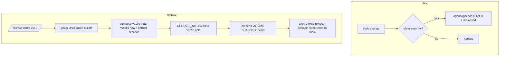

# Release notes workflow

Dev changes accumulate automatically under `## Unreleased` in
[`RELEASE_NOTES.md`](../../../../RELEASE_NOTES.md); at release time they are
finalized into the versioned note the release pipeline consumes.

## Files

| Path | Role |
|------|------|
| `RELEASE_NOTES.md` | Transient: `## Unreleased` during dev → versioned note at release (GitHub release `--notes-file`) |
| `CHANGELOG.md` | Permanent version history (Keep a Changelog); most recent section is the skeleton source for the next release note |
| `.claude/commands/release-notes.md` | `/release-notes <version>` finalizes; `/release-notes reset` restores the template |

## Dev rule (AGENTS.md § 10)

Agents add a bullet to `## Unreleased` when a change is release-note-worthy:
user-visible features, fixes, behavior changes, deprecations, breaking
changes, new platform/codec/binding support. Skip internal refactors,
docs-only, test-only, dev-tooling changes. Subsection = `Added` / `Changed` /
`Fixed` / `Removed` / `Deprecated` / `Breaking`.

## Release flow

## Runbook

1. Bump `[workspace.package] version` (root `Cargo.toml`); update
   `docs/spec/status.md` if maturity changes.
2. `/release-notes <version>` — checks the version matches, groups Unreleased,
   composes the note, archives, reports.
3. Push `release/vX.Y.Z`; workflow publishes and uses `RELEASE_NOTES.md`.
4. After the release: `/release-notes reset` on `main`.

See [`docs/contributing/repo-operations.md`](../../../contributing/repo-operations.md) § Releases.
