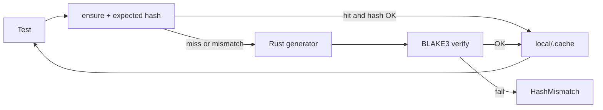

# Test media fixtures

**Rule:** test A/V fixtures are **generated by Rust**, cached locally (gitignored), and accepted only when **BLAKE3** matches the expected digest.

| Item | Value |
|------|-------|
| Crate | `mediaway-test-media` |
| Cache dir | `local/.cache/test-media/` |
| Env override | `MEDIAWAY_TEST_MEDIA_CACHE` |
| Integrity | `ensure(name, expected_blake3_hex, generate)` |
| Convention | [`docs/conventions/testing.md`](../../../conventions/testing.md) (fixtures + tiers) |
| Gate | `forbid-test-media.sh` pre-commit |

Allowed in git: generator `.rs` + expected hex constants. Forbidden: media/raw binaries.

Available generators: `ensure_solid_red_64x64` (RGBA8), `ensure_solid_gray_nv12_64x64` (NV12,
mid-gray Y/U/V), `ensure_pcm_silence_48k_stereo_20ms` (silent 16-bit PCM). Plus the raw
in-memory builders (`solid_nv12_bytes`, `pcm_silence_bytes`, …) for tests that only need bytes,
not a cached file — e.g. `mediaway-decoder-windows`'s CPU decode round-trip test builds an NV12
frame inline rather than via the cache.

Oracle: PATH reference CLI may compare/probe outputs — [system-oracle](system-oracle.md). Not used to mint canonical fixtures.
