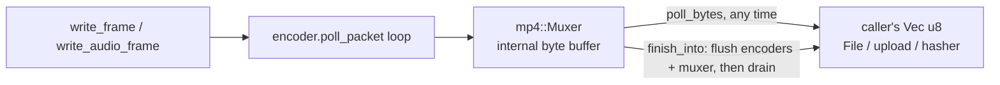

# `EncodeSession` byte output — streaming vs whole-buffer

Implemented 2026-09-18, [ADR-0006](../../../../crates/mediaway/adr/0006-encode-session-streaming-bytes.md).
Code: `crates/mediaway/src/session.rs`.

Three exits, one contract: **bytes leave the session exactly once.**

| Method | Consumes `self` | Returns |
|---|---|---|
| `poll_bytes(&mut Vec<u8>) -> usize` | no | whatever the muxer has ready, appended |
| `finish_into(self, &mut Vec<u8>) -> Result<usize>` | yes | flushes, then appends the remainder |
| `finish(self) -> Result<Vec<u8>>` | yes | `finish_into` into a fresh `Vec` |

`finish`/`finish_into` return **what has not been polled yet**, not the whole stream. A
session that never polled gets the complete recording (the pre-ADR behaviour, unchanged);
a session polled along the way gets only the tail. Concatenating every poll with the
finish result reproduces the unpolled stream byte for byte — asserted by
`session_tests.rs::polling_then_finishing_produces_the_same_stream_as_finishing_alone`.

## Why this existed as a gap

Everything below `EncodeSession` already streamed — `mediaway_container::mp4::Muxer`
implements `Mux::poll_bytes`, and `iso_bmff::mux::Muxer` drains its consumed prefix once
it passes 64 KiB, so a polled muxer's memory is bounded. The convenience layer was the
only element holding the whole file. That contradicted
[async-streaming](async-streaming.md) (streaming-first, whole-buffer as convenience) and
[api-layers](api-layers.md) (convenience composes, it does not exclude).

The visible symptom: `examples/pipeline/screen_record.rs` drives `mp4::Muxer` directly
and writes to a `File` as it goes, because it could not do that through the facade.

## Flow

## Gotchas

- `poll_bytes` returning `0` does not distinguish "nothing encoded yet" from "already
  fully drained". Track your own total if you need the difference.
- Polling never terminates the stream. Without `finish_into`/`finish` the output is a
  truncated fragment stream with no trailing fragment — same hazard as the muxer itself,
  now reachable one layer up.
- Bytes are **appended**. Reuse one buffer across a session: poll → write out → `clear()`.
- The first fragment only appears after `iso_bmff::DEFAULT_FRAGMENT_BATCH` (30) samples;
  before that a poll yields the init segment or nothing. Tests that need real bytes must
  push past that threshold.
- `finish_into`'s trailing sub-10ms audio block gap is inherited from
  [audio-track-and-apm](audio-track-and-apm.md), not introduced here.

## Testing note

`MockEncoder` in `session_tests.rs` never emits packets, so nothing reaches the muxer
through it and there are no bytes to poll. Byte-output tests use
`PacketEmittingEncoder`, which emits one deterministic packet per pushed frame — needed so
two sessions fed identical frames produce identical bytes.
