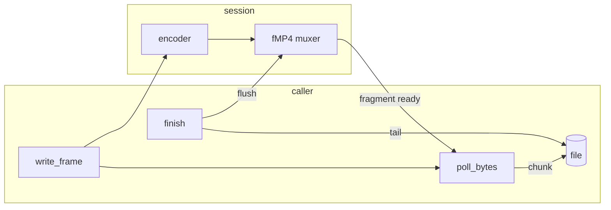

# Pipeline C ABI: streaming bytes, AAC decode, capability probes (ABI 7)

ADR: `crates/mediaway-ffi/adr/pipeline/0007-stream-bytes-aac-decode-support-probe.md`.
Code: `src/pipeline/{session,audio_decoder,capability}.rs`. Tests: `tests/{stream_bytes,aac_decode,capability_probe}_smoke.rs`.

## Streaming

`mediaway_encode_session_poll_bytes` returns the fMP4 bytes ready now as an owned buffer
(`mediaway_pipeline_ffi_buffer_free`). Nothing ready is `NULL`/`0`, no allocation.
`mediaway_encode_session_finish` returns only the **unpolled tail**, so a caller concatenates every
polled chunk and then the `finish` output. Measured: 100 H.264 frames, polled after each frame,
3 non-empty polls, 4818 B in total, the same size as an unpolled run.

## AAC decode

`mediaway_audio_decode_config_t` gained borrowed `extra_data` (the `AudioSpecificConfig`, valid for
`open` only). Session inner type is `enum { Opus, Aac }`, not `Box<dyn AudioDecoder>`.

- Empty ASC is `INVALID_INPUT`; an empty AAC packet is `INVALID_INPUT` (Opus reads it as loss
  concealment). Raw AAC only; de-header ADTS first.
- **Opus is software, identical everywhere. AAC is the OS codec**: Windows `CMSAACDecMFT`, Apple
  `AudioConverter`, `UNSUPPORTED` elsewhere, and samples can differ between hosts.
- Verified on Windows: 48 AAC packets decode to 49152 samples (48 x 1024), mean square 0.495 on a
  unit sine. The Apple arm is compile-checked for `aarch64-apple-darwin` and `-ios` only.

## Probes

`mediaway_encoder_support_at(codec, w, h)` returns rows (`backend`, `state`, `path_class`, the last
only when `SUPPORTED`); `mediaway_decoder_support(codec)` returns one state. **Both are costly** (real
throwaway sessions) and encoder support is resolution-dependent, so there is no resolution-free form.
On this RTX 4090 host, H.264 1280x720: OS, NVENC, QuickSync, Vulkan supported (CPU upload); AMF and
Software `NOT_IMPLEMENTED`. The tests pin that the answer agrees with actually opening an encoder.
