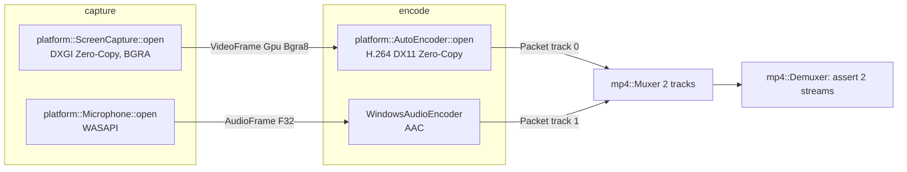

# Screen-record: video + mic → two-track fMP4

Proves Stage 1 roadmap item: screen-record composed through `mediaway`
end-to-end, with mic → `AudioEncoder` wiring, on the Zero-Copy DX11 capture path.
`examples/pipeline/screen_record.rs` now wires the same audio path too (CPU-upload
video, not this test's Zero-Copy DX11 capture — see its own doc comment).

Test: `crates/mediaway/tests/screen_mic_av_smoke.rs`.

## Composition — not an `EncodeSession` extension

ADR-0014 scopes `EncodeSession` to **video-only, single-track**; extending its public
shape for a second track needs a new ADR "if the shape changes materially" (see ADR-0014
§ Alternatives, roadmap Stage 1b). This test is the first real two-track caller, but it
does **not** touch `EncodeSession` — it composes the audio track directly against a
shared `mediaway_container::mp4::Muxer` (`Muxer::with_fragment_batch` → `add_track` ×2 →
`begin` → interleaved `push_packet`), the exact pattern already proven in
`mediaway-encoder-windows/tests/av_fmp4_smoke.rs`. Smaller diff, no new ADR triggered.

## BGRA straight into the encoder — no manual color convert

DXGI Desktop Duplication yields `PixelFormat::Bgra8` GPU textures. The H.264 Zero-Copy
path accepts `Bgra8` directly (negotiates `MFVideoFormat_ARGB32`, falling back to NV12
only if the MFT rejects it — see `mediaway-encoder-windows/src/wmf/shared.rs`, the
"live-recorder pattern"). So the captured texture is pushed straight into
`VideoEncoder::push_frame` with no BGRA→NV12 conversion step — that conversion is *not*
needed here, unlike `examples/pipeline/screen_record.rs`
(which stays on the simpler CPU-upload path, synthetic NV12 video).

## Deterministic capture on an idle desktop

DXGI's `AcquireNextFrame` only returns a frame when the desktop image *or* the pointer
position changes. An unattended background job's desktop can otherwise sit idle for the
whole capture window. The test nudges the cursor by one pixel every poll tick to keep
frames flowing deterministically, then restores the original cursor position.

## Known environment gap (not a wiring bug)

On some execution sessions (e.g. certain automated/background job contexts), Media
Foundation hardware transforms — both the DX11 H.264 hardware MFT *and* the AAC encoder
MFT (a pure software codec, no GPU involved) — fail to activate with `EncodeError::Backend`
even though screen + mic capture succeed. The **pre-existing** sibling tests
(`av_fmp4_zc_smoke.rs`, `av_fmp4_smoke.rs`, the `audio_tests::open_aac_encodes_silence_pcm`
unit test) skip identically in that same session — this is an existing, already-tolerated
environment limitation, not something introduced by this composition. The test skips
honestly (`eprintln!("skip: …")`) rather than failing when it hits this.
