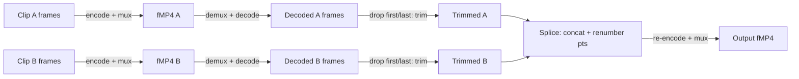

# Trim + splice (decode → edit → re-encode)

Real non-linear edit built from low-level traits, not a new abstraction:

- **Trim** = slice the decoded `Vec<VideoFrame>` by index/PTS — no new type.
- **Splice** = `Iterator::chain` the trimmed segments, then renumber `pts`/`duration`
  contiguously before re-encoding (H.264 packet timestamps must be monotonic).
- No `DecodeSession`/`EditTimeline` abstraction added — this is a one-off composition
  in `tests/trim_and_splice_windows.rs` + `examples/pipeline/trim_and_splice.rs`, matching the
  "no premature abstraction" rule. Add one only when a second real caller needs it.

**What this test found**: going through a real `mediaway_container::mp4::Muxer` →
`Demuxer` round trip (unlike `mediaway-decoder::windows`'s own `cpu_roundtrip.rs`, which
never touches a container) exposed that demuxed H.264 samples are AVCC-framed while
WMF's decoder MFTs expect Annex-B — see [`decode/scaffold`](../decode/scaffold.md) and
`mediaway-decoder::windows` ADR-0001 for the fix.

**Muxer convention**: pass **empty** `extra_data` to `Muxer::add_track` for H.264 —
the muxer derives a proper `avcC` record from the first packet's in-band SPS/PPS
(`iso_bmff::bitstream::avc::to_avcc`). Passing an encoder's own Annex-B-style
`extra_data` verbatim gets stored as-is (not converted), which is wrong for the `avcC`
box. `crates/mediaway-encoder/tests/windows/av_fmp4_smoke.rs` does this "wrong" thing too but
never decodes its own output, so it never caught it.

`mediaway::platform::AutoDecoder::open`/`AutoEncoder::open` now also dispatch
to `mediaway-decoder::linux`/`mediaway-encoder::linux` under `#[cfg(target_os = "linux")]`
(added alongside `tests/trim_and_splice_linux.rs`, the Linux mirror of the Windows test
above), so `examples/pipeline/trim_and_splice.rs` is unchanged and truly cross-platform. Web
still needs its decoder backend wired in before getting the same call.

**Linux is untested, not just unverified**: `mediaway-decoder::linux`'s `push_packet`/
`extra_data` handling assumes Annex-B framing (its own ADR-0001 + roadmap already track
this as an open item, mirroring the pre-fix Windows gap above) — demuxed MP4 packets
are AVCC length-prefixed, so a real decode would hit the same class of bug this test
found on Windows. `trim_and_splice_linux.rs` cannot expose it: every run in this
session's environment fails earlier, at `Display::open()` (no VA-API driver), so
`push_packet` is never reached. Fixing Windows did not fix Linux — track separately.
