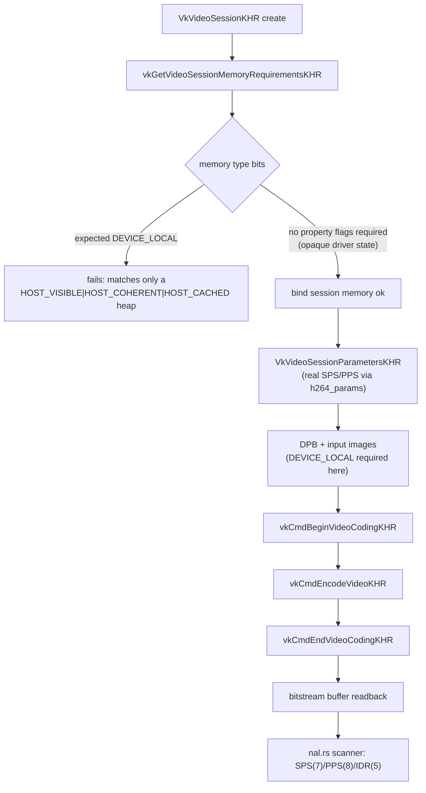

# Vulkan Video encode (`mediaway-encoder::vulkan`)

Module: `mediaway-encoder::vulkan` (portable — not OS-suffixed; Vulkan Video is
one API across Windows/Linux/Android). ADR:
[`0001-vulkan-video-encode-ash-probe.md`](../../../../crates/mediaway-encoder/adr/vulkan/0001-vulkan-video-encode-ash-probe.md).

**Binding crate: `vulkanalia`, not `ash`** (migrated 2026-07-29, ADR-0001's
migration addendum) — `ash` 0.38 had no `VK_KHR_video_encode_av1` bindings and
no committed timeline for them; `vulkanalia` has complete AV1 bindings and is
actively released. Zero H.264/HEVC regression from the swap (byte-identical
hardware re-verification).

## Stage 0: capability probe (real, hardware-verified)

`probe::probe_video_encode_queue_families` — instance + physical
device + `vkGetPhysicalDeviceQueueFamilyProperties2` chained with
`VkQueueFamilyVideoPropertiesKHR`. On the test machine:
RTX 4090 advertises H.264 **and** H.265 encode on queue family 4; Intel UHD
770's Windows Vulkan driver advertises **no** video-encode queue at all — a
real per-driver finding, not a probe bug. Real bug caught by the hardware
run: `VK_KHR_video_queue` is a **device** extension, not an instance one —
every driver rejected the first draft's `InstanceCreateInfo` enablement with
`VK_ERROR_EXTENSION_NOT_PRESENT`.

## Stage 1: minimal H.264 encode (real, hardware-verified, 2026-07-29)

`session_encode::encode_synthetic_intra_frame` — one real, hardware-run
all-intra H.264 frame end to end. Not a `mediaway_encoder::VideoEncoder`
impl, not multi-frame, not rate-controlled, not Zero-Copy.

Result on the RTX 4090: 160x64 frame, 4115 bitstream bytes, Annex-B
SPS(7)/PPS(8)/IDR(5) — confirmed by this crate's own scanner **and**
independently by a system-FFmpeg oracle (pixel-exact decode of the synthetic
gray input). Real blocker hit and fixed: the memory-type-bits branch above —
session memory needs **no** specific property flags (only the DPB/input
images do); an earlier draft wrongly required `DEVICE_LOCAL` there too.

## HEVC + AV1 (2026-07-29)

HEVC: `hevc_params.rs`/`session_command_hevc.rs`, hardware-verified real
VPS/SPS/PPS + slice-segment encode. `picture_access_granularity` is **32x32**
on this driver, not 16x16 like H.264 — query per codec, never assume equal.

AV1: `av1_params.rs`/`session_command_av1.rs`, implemented but **blocked on
the RTX 4090** — device/session/session-parameters/sequence-header are all
real and hardware-verified (`vkGetEncodedVideoSessionParametersKHR` returns a
genuine `OBU_SEQUENCE_HEADER`), but every `vkCmdEncodeVideoKHR` frame's own
output is not a valid OBU stream. Independently confirmed **not** this
crate's bug: `ffmpeg -c:v av1_vulkan` on the same machine produces AV1
`dav1d` itself rejects (up to 73% decode error rate) — a driver-maturity
limitation; see ADR-0001's AV1 addendum for the full debugging trail (6 real
bugs found/fixed by diffing against FFmpeg's `vulkan_encode_av1.c`).
`push_three_av1_frames_or_skip` self-documents and skips rather than
hard-fails. **Re-verified 2026-08-07** (same driver `32.0.15.9579`, identical
0.733333 dav1d error rate) — unchanged, not a self-inflicted bug (unlike
D3D12's AV1 wrong-query bug — [windows-encode-d3d12](windows-encode-d3d12.md)).

## Scope cuts (all documented in code + ADR)

- No `VK_LAYER_KHRONOS_validation` (no Vulkan SDK on the test machine) —
  validated against `vulkanalia`'s generated `Extends*KHR` marker traits instead.
- No exact-byte-count query-pool feedback for Stage 1's one-shot diagnostic
  (fixed for the real `VideoEncoder` impl via `VK_QUERY_TYPE_VIDEO_ENCODE_FEEDBACK_KHR`).
  No per-object RAII on error paths there either — single-shot, not a
  reusable session (the real `VideoEncoder` impl tears down explicitly).
- Coarse (not perf-tuned) `sync2` barriers.

## GOP / rate control (Stage 2 — H.264 + HEVC hardware-verified; AV1 unverifiable)

[ADR-0002](../../../../crates/mediaway-encoder/adr/vulkan/0002-vulkan-gop-rate-control.md):
multi-slot DPB + P-frame single-forward-reference prediction for H.264, HEVC,
and AV1 (each a separate `GopState` type), plus CBR + live
`VideoEncoder::set_bitrate` (2026-08-07) for **H.264 only**. Capability-gated,
falls back to key-frame-only/fixed-QP with no error. **B-frames are a
permanent non-goal.** Real hardware: `gop_size = 3` over 7 frames produced
the exact `I P P I P P I` cadence for H.264/HEVC, real CBR + live
`set_bitrate` retarget for H.264 —
[vulkan-h264-gop](../encode/vulkan-h264-gop.md) /
[vulkan-hevc-gop](../encode/vulkan-hevc-gop.md). AV1's wiring is real and
capability-gated the same way but **genuinely unverifiable** — built on the
already-broken AV1 base above — see [vulkan-av1-gop](../encode/vulkan-av1-gop.md).

## Related

- [linux-encode](linux-encode.md), [windows-encode](windows-encode.md) — OS-suffixed siblings; README § GPU (Vulkan column)
