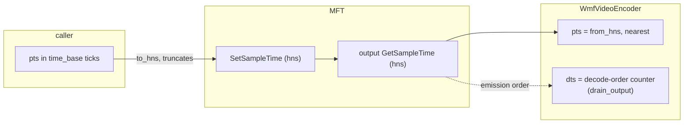

# Windows timestamps (WMF encode + decode)

How a timestamp crosses Media Foundation, and how this workspace got it wrong.
`mediaway-encoder/adr/windows/0013-wmf-timestamp-round-trip.md` (read its § Correction).

## The round trip

MF speaks 100-nanosecond units (`hns`). A packet timestamp in `time_base` ticks is converted
on the way in (`to_hns`, onto the input `IMFSample`) and back on the way out (`from_hns`).
**The pair must be an exact inverse**, or distinct ticks collapse:

Both directions used to truncate, and 10 000 000 does not divide most denominators. At `1/60`,
`7 → 1 166 666 → 6`. `from_hns` now rounds to nearest (fixed 2026-09-18, both crates).

**The two codecs broke differently.** Same 30 ticks, RTX 4090 host:

| | MFT returns | truncated result |
|---|---|---|
| HEVC | exactly the hns written | **20 distinct** of 30: collapse |
| H.264 (inbox) | recomputed, a hair below each tick, B-frames, one-tick reorder delay | distinct, but the delay is shaved off: **`dts > pts`** |

qarec records HEVC, hence its 279-packet / 215-distinct-pts file.

**Nearest vs away-from-zero:** they agreed on every value measured. No MFT was seen rounding
*up*; nearest wins only in that unobserved case. Do not cite it as measured.

## Decode timestamps

`sample_to_packet` writes `dts: pts`, and **`drain_output` overwrites it** for video with a
decode-order counter. Read `drain_output` before reasoning about video `dts` from
`sample_to_packet` alone — that mistake produced a false claim and some dead code in #100.

**Open (ADR-0013 § Open question):** the counter advances one tick per frame. Under irregular
input (ticks `0, 4, 6, 10, …`) the MFT's `MFSampleExtension_DecodeTimestamp` tracked the real
times while the counter went `0, 1, 2, 3, …`. Variable-rate capture diverges.

## ffmpeg's warning is about its output, not your file

*"non monotonically increasing dts to muxer in stream 0"* while **decoding** (`-f null`) means
ffmpeg's decoded frames carry duplicate timestamps — i.e. duplicate **pts** in the input.
Check the file's own `dts` with `ffprobe -show_entries packet=pts,dts` before blaming it.
It reproduces only with an audio track present; a video-only file with the same duplicates
decodes silently.

## Testing note

`crates/mediaway-encoder/tests/windows/*.rs` are **never compiled** — cargo does not pick up
`tests/<dir>/*.rs` without a `main.rs`. `mediaway-decoder` hit this and moved its file up
(see [windows-decode](windows-decode.md)). Put new integration tests directly in `tests/`.

A regression test must fail on the old code. `wmf_timestamp_round_trip` is checked that
way, by reinstating the truncation: HEVC fails on collapse, H.264 on `dts > pts`.
