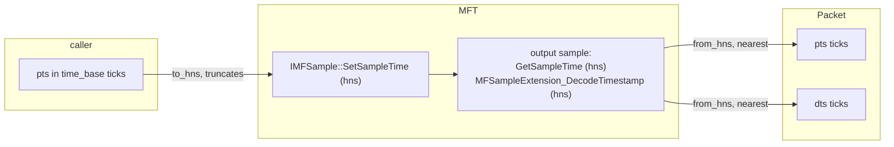

# Windows timestamps (WMF encode + decode)

How a timestamp crosses Media Foundation, and the two ways this workspace got it wrong.
Fixed 2026-09-18 — `mediaway-encoder/adr/windows/0013-wmf-timestamp-round-trip.md`.

## The round trip

MF speaks 100-nanosecond units (`hns`). A packet timestamp in `time_base` ticks is converted
on the way in (`to_hns`, on the input `IMFSample`) and back on the way out (`from_hns`, from
the output sample). **The pair must be an exact inverse**, or distinct ticks collapse:

Both directions used to truncate. 10 000 000 does not divide most timebase denominators, so
at `1/60` only every third tick survived (`7 → 1 166 666 → 6`). A real 1/60 recording came
out with **279 packets and 215 distinct presentation timestamps**. `1/30`, `1/24`,
`1001/30000` and audio (`aac.rs` shares `to_hns`) were all affected; `mediaway-decoder` had
an identical copy of the pair.

**`from_hns` rounds to nearest.** Not "away from zero" — that is also an exact inverse on
paper and was tried first, and it is **wrong against a real MFT**: the MFT does not echo the
hns written to it, it recomputes sample times with its own rounding, so values arrive a
fraction of a tick above the exact one as often as below. Away-from-zero displaced a whole
30-frame sequence by one frame. Only a test against a real encoder caught it.

Exactness holds while a tick is worth ≥2 hns (`den <= num * 5e6`). Finer than that, the
precision is already gone inside `to_hns`.

## `dts` is not `pts`

`sample_to_packet` reported `dts: pts`. The inbox H.264 MFT emits **B-frames**, in decode
order — measured, 30 frames pushed at ticks 0..29 came back as:

| | sequence |
|---|---|
| pts | `1, 3, 2, 5, 4, … 29, 28, 30` |
| dts | `0, 1, 2, … 29` |

With `dts = pts` that track marched backwards every other packet, which is literally what
ffmpeg's *"non monotonically increasing dts to muxer"* was reporting. `dts` now comes from
**`MFSampleExtension_DecodeTimestamp`**, present only when the MFT reorders; absent it, `pts`
*is* the decode time and the fallback is correct.

`iso_bmff::Muxer::push_packet` already derives the container's composition offset from
`pts - dts`, so the fix costs nothing downstream — that offset had simply been zero forever.

The `+1` on pts is **not** a defect: it is the reorder delay that lets the first `dts` be 0.
`gop_size: 1` did **not** stop this MFT reordering — do not assume it disables B-frames.

## Testing note

`crates/mediaway-encoder/tests/windows/*.rs` are **never compiled** — `cargo` does not pick
up `tests/<dir>/*.rs` without a `main.rs`. `mediaway-decoder` already hit this and moved its
file up (see [windows-decode](windows-decode.md)); the encoder's two are still down there.
Put new integration tests directly in `tests/`.
